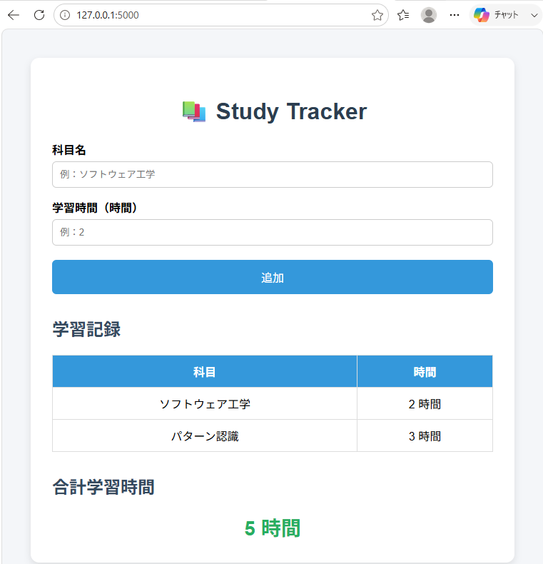

# Study Tracker

## システム概要

Study Tracker は、学習した科目と学習時間を記録するシンプルなWebアプリケーションです。

入力した学習記録を一覧表示し、合計学習時間を自動で計算します。

データはメモリ上で管理しているため、コンテナを停止すると記録はリセットされます。

---

## 主な機能

- 科目名の入力
- 学習時間の入力
- 学習記録の追加
- 学習記録一覧の表示
- 合計学習時間の表示

---

## 使用技術

- Python 3.11
- Flask
- HTML
- CSS
- Docker
- Docker Compose

---

## フォルダ構成

```
study-tracker
│
├── app.py
├── requirements.txt
├── Dockerfile
├── docker-compose.yml
├── README.md
├── templates
│   └── index.html
└── static
    └── style.css
```

---

## 起動方法

Docker Desktop を起動した状態で、プロジェクトフォルダを開き、以下を実行します。

```bash
docker compose up --build
```

起動後、ブラウザで次のURLへアクセスします。

```
http://localhost:5000
```

---

## 使い方

1. 科目名を入力します。
2. 学習時間を入力します。
3. 「追加」ボタンを押します。
4. 学習記録一覧へ表示されます。
5. 合計学習時間が自動で更新されます。

---

## 動作画面

以下は Study Tracker の実行画面です。



この画面では、科目名と学習時間を入力して学習記録を追加できるほか、登録した学習記録の一覧と合計学習時間が表示されます。


## ライセンス

教育目的で作成したサンプルプログラムです。